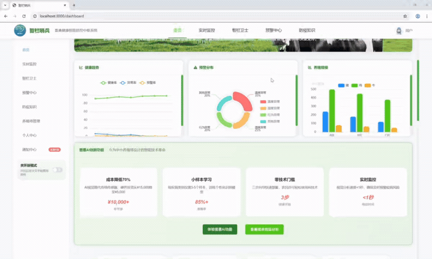
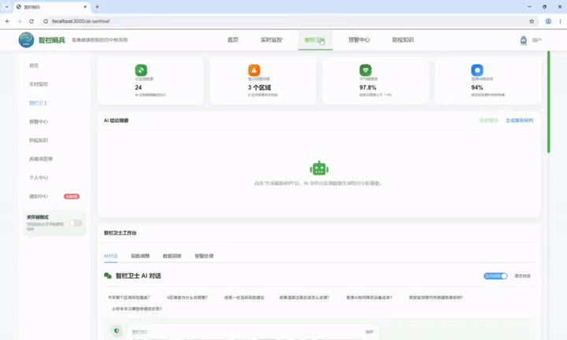
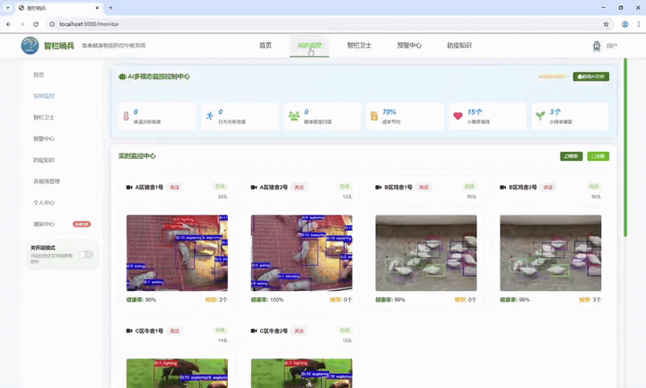
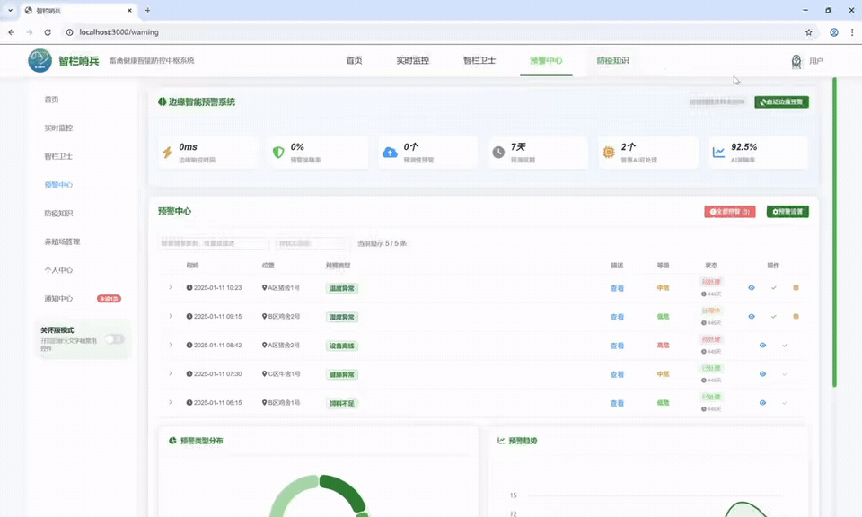
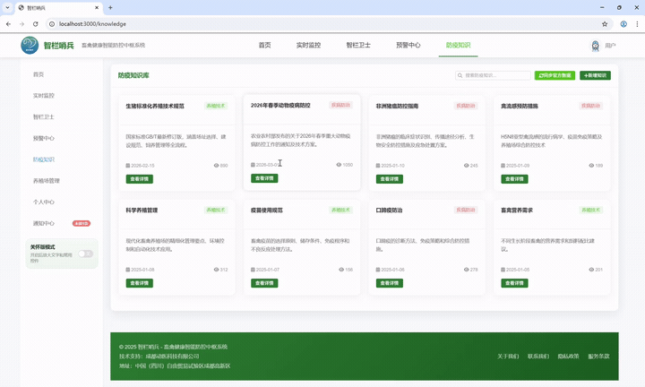
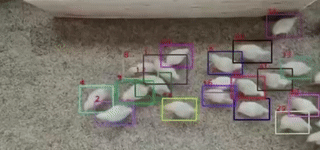
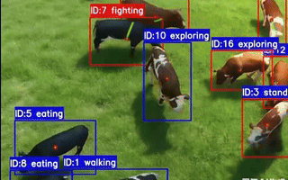
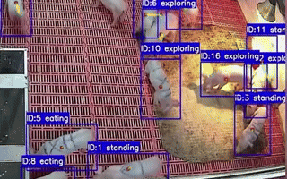

# 智栏哨兵 - Intelligent Prevention Control Hub


## 🎯 项目概述

**智栏哨兵** 是一套基于 AI + 物联网技术的畜禽健康智能防控系统，专注于为中小型养殖场提供低成本、高效率的健康监测解决方案。系统通过计算机视觉、机器学习等 AI 技术，实现对畜禽健康状态的智能化监测和预警。

## ✨ 核心特色

### 🤖 AI 智能监测
- **计算机视觉分析**：基于 TensorFlow.js 的实时视频分析
- **多模态数据融合**：图像、传感器数据、环境参数智能关联
- **边缘预测系统**：本地化 AI 推理，减少云端依赖
- **少量样本学习**：只需少量图片即可训练个性化模型

### 💰 普惠AI设计
- **零技术门槛**：专为中小养殖场定制，无需专业技术背景
- **成本大幅降低**：相比传统方案成本降低 70%
- **一键部署**：快速配置，即时启用
- **传感器替代**：用 AI 技术替代昂贵硬件传感器

### 📊 全方位监测
- **健康状态分析**：自动识别畜禽行为异常
- **环境参数监控**：温湿度、光照、通风等实时监测
- **预警系统**：多维度风险评估和智能预警
- **数据可视化**：丰富的图表和报表展示

## 🔧 技术架构

### 前端技术栈
- **框架**: Vue 3 + Composition API
- **UI组件**: Element Plus
- **构建工具**: Vite
- **路由管理**: Vue Router 4
- **HTTP客户端**: Axios

### AI 技术栈
- **机器学习**: TensorFlow.js
- **计算机视觉**: 图像分类、行为识别
- **边缘计算**: 本地化模型推理
- **数据分析**: ECharts 数据可视化

### 数据流架构
```
摄像头/传感器 → AI 分析 → 数据聚合 → 可视化展示 → 预警推送
```

## 🎬 功能演示

### 🏠 系统首页概览


**功能特色**:
- 综合数据仪表板
- 关键指标可视化展示
- 环境监测实时数据
- AI智能建议推送

---

## 📱 功能模块

### 1. 登录认证 (`Login.vue`)
- 用户身份验证
- 模拟登录模式（后端不可用时）
- 安全会话管理

### 2. 智能仪表板 (`Dashboard.vue`)


**核心功能**:
- ✅ 关键指标概览（健康率、预警数、设备状态）
- ✅ 实时环境监测（温湿度、空气质量等）
- ✅ AI 智能建议推送
- ✅ 数据趋势图表

### 3. AI 智能哨兵 (`AISentinel.vue`)


**AI智能特性**:
- 🧠 基于深度学习的健康状态分析
- 🔍 影响因素智能识别
- 💡 优化建议自动生成
- 📊 预测性维护提醒

### 4. 普惠AI监测 (`affordableAIPanel.vue`)
**普惠AI优势**:
- 💰 低成本 AI 监测解决方案
- 🚀 快速模型训练向导
- 📷 样本照片上传和管理
- 📈 监测效果可视化

### 5. 实时监控中心 (`Monitor.vue`)


**监控能力**:
- 📹 多路视频流实时展示
- 📊 环境参数曲线图
- 🐔 畜禽活动量统计
- ⚠️ 异常行为检测

### 6. 预警中心 (`Warning.vue`)


**预警系统**:
- 🚨 实时预警信息展示
- 📋 预警类型分布分析
- ⏰ 24小时趋势预测
- ✅ 快速处理机制

### 7. 专业知识库 (`Knowledge.vue`)


**知识体系**:
- 📖 养殖技术规范
- 🩺 疾病防治指南
- ⚖️ 政策法规查询
- 🔍 智能知识搜索

### 8. 养殖场管理 (`RanchManagement.vue`)
**管理功能**:
- 🏭 养殖场基础信息管理
- 💻 设备资产管理
- 🌾 饲喂记录管理
- 📋 畜禽档案维护

### 9. 性能看板 (`PerformanceDashboard.vue`)
**性能监控**:
- 📈 系统性能监控
- 💹 成本效益分析
- 👥 用户行为统计
- ❤️ 系统健康度评估

---

## 🐄 🐓 🐖 动物监测展示

### 鸡类监测


### 牛类监测  


### 猪类监测


**智能监测特性**:
- 🎯 多物种兼容性
- 📡 实时行为分析
- 🏥 健康状态评估
- 📱 移动端适配

## 🚀 快速开始

### 环境要求
- Node.js >= 16.0
- npm >= 8.0
- 现代浏览器（支持 WebGL）

### 安装步骤

1. **克隆项目**
```bash
git clone <项目地址>
cd intelligent-prevention-control-hub
```

2. **安装依赖**
```bash
npm install
```

3. **启动开发服务器**
```bash
npm run dev
```

4. **访问应用**
打开浏览器访问：http://localhost:3000

### 模拟登录（开发测试）
- 用户名：admin
- 密码：123456

### 构建生产版本
```bash
npm run build
```

## ⚙️ 配置说明

### 环境变量配置
创建 `.env.development` 文件：
```env
VITE_API_BASE_URL=http://your-api-server:8081
VITE_USE_PROXY=true
VITE_ENABLE_MOCK=true
```

### AI 模型配置
系统支持多种预训练模型：
- MobileNetV2（轻量级，适合移动设备）
- ResNet50（高精度，适合服务器部署）

## 🗂️ 项目结构

```
src/
├── api/                    # API 接口层
│   ├── auth.js            # 认证接口
│   ├── dashboard.js       # 仪表板数据
│   ├── povertyAI.js       # 普惠AI接口
│   └── ...
├── components/            # 页面组件
│   ├── Dashboard.vue      # 仪表板
│   ├── AISentinel.vue     # AI智能分析
│   ├── affordableAIPanel.vue # 普惠AI
│   └── ...
├── utils/                 # 工具函数
│   ├── tensorflowService.js # TensorFlow服务
│   ├── edgePredictiveAlert.js # 边缘预测
│   ├── visionSensor.js    # 视觉传感器
│   └── ...
├── config/                # 配置文件
├── assets/                # 静态资源
└── router/                # 路由配置
```

## � Docker 部署

### 构建镜像
```bash
docker build -t zhilan-sentinel .
```

### 运行容器
```bash
docker run -d -p 8080:80 --name zhilan-sentinel zhilan-sentinel
```

访问：http://localhost:8080

## 🔍 开发指南

### 新增 AI 功能
1. 在 `utils/` 目录创建新的服务模块
2. 在对应组件中引入和使用
3. 配置相关的 API 接口

### 自定义模型
系统支持自定义 TensorFlow.js 模型，参考 `tensorflowService.js` 实现。

## 🤝 参与贡献

欢迎提交 Issue 和 Pull Request 来改进项目。

## � 许可证

本项目采用 MIT 许可证。详见 [LICENSE](LICENSE) 文件。

## 📞 联系我们

如有问题或建议，请通过以下方式联系：
- 邮箱：support@example.com
- 项目主页：https://github.com/your-repo

---

**最后更新**: 2026年4月  
**版本**: v1.0.0